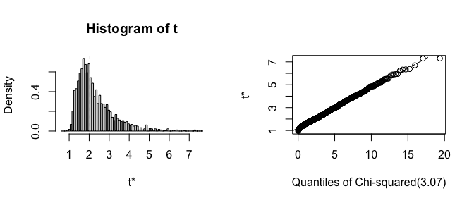
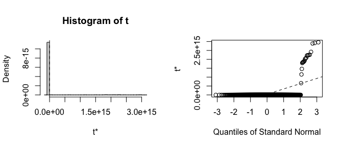
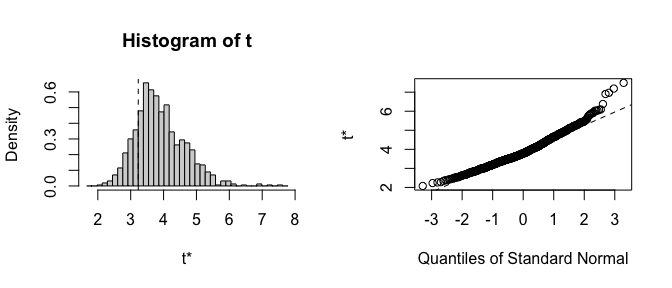

<!-- README.md is generated from README.Rmd. Please edit that file -->

# `fwb`: Fractional Weighted Bootstrap

<!-- badges: start -->

[](https://CRAN.R-project.org/package=fwb)
<!-- badges: end -->

`fwb` implements the fraction weighted bootstrap, also known as the
Bayesian bootstrap, following the treatment by Xu et al. (2020). The
primary function is `fwb()`, which is essentially a drop-in for
`boot::boot()` in that it takes in a dataset and a function and applies
that function to the dataset, generating sets of weights from a uniform
Dirichlet distribution to be applied to the statistic(s) computed in the
function. Also included are `fwb.ci()`, a drop-in for `boot::boot.ci()`
for computing various kinds of confidence intervals (e.g., percentile,
normal, bias-corrected percentile, etc.), and `vcovFWB()`, a drop-in for
`sandwich::vcovBS()` for computing a parameter covariance matrix from a
regression model using the fractional weighted bootstrap.

Check out the `fwb` [website](https://ngreifer.github.io/fwb)!

## Installation

You can install the development version of `fwb` from
[GitHub](https://github.com/) with:

``` r
# install.packages("devtools")
devtools::install_github("ngreifer/fwb")
```

## Examples

Below are some examples of how to use `fwb`.

``` r
library("fwb")
```

### Bearing cage field failure Weibull analysis from Xu et al. (2000)

This example involves performing a Weibull analysis to estimate the
$\beta$ (shape) parameter of the Weibull distribution characterizing the
time to failure of a set of aircraft engines. Among the 1703 engines,
there were only 6 failures and 1697 right-censored observations. The
traditional (resampling-based) bootstrap would fail if a bootstrap
replication omitted the 6 failures, but all failures are retained when
using the fractional weighted bootstrap, which makes it particularly
effective for this analysis.

``` r
data("bearingcage", package = "fwb")

# Function to compute the scale (eta) and shape (beta) parameters
# from weighted data
weibull_est <- function(data, w) {
  fit <- survival::survreg(survival::Surv(hours, failure) ~ 1,
                           data = data, weights = w,
                           dist = "weibull")

  c(eta = unname(exp(coef(fit))), beta = 1/fit$scale)
}

# 1999 bootstrap replications; more is always better
fwb_est <- fwb(bearingcage, statistic = weibull_est,
                R = 1999, verbose = FALSE)
fwb_est
#> FRACTIONAL WEIGHTED BOOTSTRAP
#> 
#> Call:
#> fwb(data = bearingcage, statistic = weibull_est, R = 1999, verbose = FALSE)
#> 
#> Bootstrap Statistics :
#>         original         bias   std. error
#> t1* 11792.178173 6528.5275456 21092.241147
#> t2*     2.035319    0.2540133     0.894168

# Bias-corrected percentile confidence interval
summary(fwb_est, ci.type = "bc")
#>      Estimate Std. Error CI 2.5 % CI 97.5 %
#> eta  1.18e+04   2.11e+04 3.18e+03  7.21e+04
#> beta 2.04e+00   8.94e-01 1.23e+00  4.58e+00

# Plot the bootstrap distribution
plot(fwb_est, index = "beta", qdist = "chisq")
```



### Infertility logistic regression analysis using `infert` dataset

This example demonstrates using `vcovFWB()` to estimate standard errors
for the effect of spontaneous and induced abortions on infertility as
analyzed in Trichopoulos et al. (1976). Patients are organized into
matched sets of 3 patients each. We use a fixed effects logistic
regression to adjust for matched set membership (ignoring the potential
bias in this approach for the sake of the example). The traditional
bootstrap fails because many matched sets will fully omit either cases
or non-cases, leading to perfect prediction and the failure of the model
to converge, yielding invalid estimates. Because all units are retained
when using the fractional weighted bootstrap, the model always converges
and the estimates are reasonable.

``` r
data("infert")

fit <- glm(case ~ spontaneous + induced + factor(stratum),
           data = infert, family = quasibinomial())

library("lmtest")

# The traditional bootstrap fails
coeftest(fit, vcov = sandwich::vcovBS)[1:3,]
#>              Estimate   Std. Error       z value  Pr(>|z|)
#> (Intercept) -6.904101 4.472792e+19 -1.543577e-19 1.0000000
#> spontaneous  3.230286 3.167708e+06  1.019755e-06 0.9999992
#> induced      2.190303 3.102472e+06  7.059862e-07 0.9999994

# The fractional weighted bootstrap succeeds
coeftest(fit, vcov = vcovFWB)[1:3,]
#>              Estimate Std. Error   z value     Pr(>|z|)
#> (Intercept) -6.904101  1.8276925 -3.777496 1.584130e-04
#> spontaneous  3.230286  0.7277096  4.438976 9.038774e-06
#> induced      2.190303  0.6857453  3.194047 1.402932e-03
```

We can also perform cluster-robust inference by bootstrapping the
strata. (Note in this case the traditional bootstrap does fine, but the
fractional weighted bootstrap is still more accurate.)

``` r
# Including stratum membership as a clustering variable
coeftest(fit, vcov = vcovFWB, cluster = ~stratum)[1:3,]
#>              Estimate Std. Error   z value     Pr(>|z|)
#> (Intercept) -6.904101  1.6495855 -4.185355 2.847204e-05
#> spontaneous  3.230286  0.7628024  4.234761 2.287951e-05
#> induced      2.190303  0.6682861  3.277493 1.047335e-03
```

Let’s look more in-depth at the results of the traditional and
fractional weighted bootstrap by comparing the output of `fwb()` and
`boot::boot()`.

``` r
fit_fun <- function(data, w) {
  fit <- glm(case ~ spontaneous + induced + factor(stratum),
           data = data, weights = w, family = quasibinomial())
  coef(fit)[1:3]
}

boot_est <- boot::boot(infert, fit_fun, R = 999, stype = "f")
boot_est
#> 
#> ORDINARY NONPARAMETRIC BOOTSTRAP
#> 
#> 
#> Call:
#> boot::boot(data = infert, statistic = fit_fun, R = 999, stype = "f")
#> 
#> 
#> Bootstrap Statistics :
#>      original        bias     std. error
#> t1* -6.904101 -2.385907e+19 5.368296e+20
#> t2*  3.230286  4.072669e+13 2.952474e+14
#> t3*  2.190303  2.730053e+13 2.009225e+14

fwb_est <- fwb(infert, fit_fun, R = 999, verbose = FALSE)
fwb_est
#> FRACTIONAL WEIGHTED BOOTSTRAP
#> 
#> Call:
#> fwb(data = infert, statistic = fit_fun, R = 999, verbose = FALSE)
#> 
#> Bootstrap Statistics :
#>      original       bias std. error
#> t1* -6.904101 -1.6181838  1.8461133
#> t2*  3.230286  0.6611793  0.7424671
#> t3*  2.190303  0.5056567  0.6588132
```

Already the bias and standard errors indicate problems with the
traditional bootstrap. Let’s plot histograms of the estimates to see
where the failure is:

``` r
plot(boot_est, index = 2)
```



``` r
plot(fwb_est, index = 2)
```



It is clear that the estimates from the traditional bootstrap are
pathological, whereas the estimates from the fractional weighted
bootstrap are more reasonable. The non-normality of the fractional
weighted bootstrap distributions also suggests that the usual Wald-style
confidence intervals may not be accurate, and a percentil interval
should be computed instead.

## When to use the fractional weighted bootstrap

The fractional weighted bootstrap is uniformly more reliable than the
traditional bootstrap when a weighted statistic can be computed (though
this doesn’t mean the bootstrap is always valid). In most simple case,
both methods will yield the same results. In some pathological examples
like those above, the fractional weighted bootstrap dramatically
outperforms the traditional bootstrap. This will be true when running
regression models with sparse categorical variables either in the
outcome or among the predictors, for example, when estimating fixed
effects or when a binary outcome is rare. However, it is important to
know when a weighted statistic can be computed; for example, computing
the weighted median is not always straightforward, making the
traditional bootstrap potentially more useful for computing it. Still,
though, the fractional weighted bootstrap deserves a place in an
analysts toolbox.

## Related packages

-   `boot`, which provides the traditional bootstrap, including an
    interface that accepted frequency weights to compute weighted
    statistics, as was used above
-   `bayesboot`, which also provides functionality for the Bayesian
    bootstrap but does so in a more explicitly Bayesian fashion and with
    returned objects that are less consistent with those from `boot`

## Author

-   Noah Greifer (noah.greifer@gmail.com)

## References

Trichopoulos, D., Handanos, N., Danezis, J., Kalandidi, A. and
Kalapothaki, V. (1976), Induced Abortion and Secondary Infertility.
*BJOG: An International Journal of Obstetrics & Gynaecology*, 83,
645-650. <https://doi.org/10.1111/j.1471-0528.1976.tb00904.x>

Xu, L., Gotwalt, C., Hong, Y., King, C. B., & Meeker, W. Q. (2020).
Applications of the Fractional-Random-Weight Bootstrap. *The American
Statistician*, 74(4), 345–358.
<https://doi.org/10.1080/00031305.2020.1731599>
