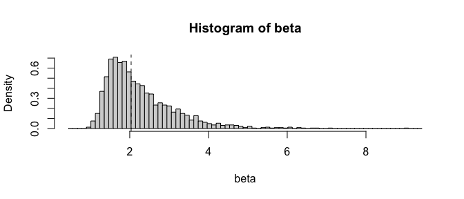
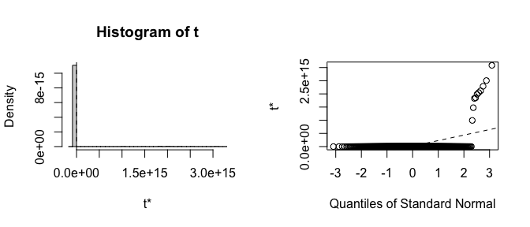
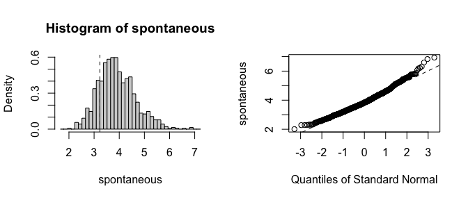

<!-- README.md is generated from README.Rmd. Please edit that file -->

# `fwb`: Fractional Weighted Bootstrap

<!-- badges: start -->

[](https://CRAN.R-project.org/package=fwb)
<!-- badges: end -->

`fwb` implements the fractional weighted bootstrap (FWB), also known as
the Bayesian bootstrap, following the treatment by Xu et al. (2020). The
FWB involves generating sets of weights from a uniform Dirichlet
distribution to be used in estimating statistics of interest, which
yields a posterior distribution that can be interpreted in the same way
the traditional (resampling-based) bootstrap distribution can be. The
primary function is `fwb()`, which is essentially a drop-in for
`boot::boot()` in that it takes in a dataset and a function and applies
that function to the dataset and a randomly generated set of case
weights. Also included are `fwb.ci()`, a drop-in for `boot::boot.ci()`
for computing various kinds of confidence intervals (e.g., percentile,
normal, bias-corrected percentile, etc.), and `vcovFWB()`, a drop-in for
`sandwich::vcovBS()` for computing a coefficient covariance matrix from
a regression model using the FWB.

Check out the `fwb` [website](https://ngreifer.github.io/fwb/)!

## Installation

You can install the current stable version of `fwb` from CRAN with:

``` r
install.packages("fwb")
```

You can install the development version of `fwb` from
[GitHub](https://github.com/) with:

``` r
# install.packages("remotes")
remotes::install_github("ngreifer/fwb")
```

## Examples

Below are some examples of how to use `fwb`. We set a seed to ensure all
results are replicable. (Note that when parallel processing is used, a
special kind of seed needs to be set; see `vignette("fwb-rep")` for
details.)

``` r
library("fwb")
set.seed(123456, "L'Ecuyer-CMRG")
```

### Bearing cage field failure Weibull analysis from Xu et al. (2020)

This example involves performing a Weibull analysis to estimate the
$\beta$ (shape) parameter of the Weibull distribution characterizing the
time to failure of a set of aircraft engines. Among the 1703 engines,
there were only 6 failures and 1697 right-censored observations. The
traditional (resampling-based) bootstrap would fail if a bootstrap
replication omitted the 6 failures, but all failures are retained when
using the FWB, which makes it particularly effective for this analysis.

``` r
data("bearingcage", package = "fwb")

# Function to compute the scale (eta) and shape (beta) parameters
# from weighted data
weibull_est <- function(data, w) {
  fit <- survival::survreg(survival::Surv(hours, failure) ~ 1,
                           data = data, weights = w,
                           dist = "weibull")

  c(eta = unname(exp(coef(fit))),
    beta = 1 / fit$scale)
}

# 1999 bootstrap replications; more is always better
fwb_est <- fwb(bearingcage, statistic = weibull_est,
               R = 1999, verbose = FALSE)
fwb_est
#> FRACTIONAL WEIGHTED BOOTSTRAP
#> 
#> Call:
#> fwb(data = bearingcage, statistic = weibull_est, R = 1999, verbose = FALSE)
#> 
#> Bootstrap Statistics :
#>          original         bias   std. error
#> eta  11792.178173 7722.5390790 2.652048e+04
#> beta     2.035319    0.2326988 8.790395e-01

# Bias-corrected accelerated percentile
# confidence interval
summary(fwb_est, ci.type = "bca")
#>      Estimate Std. Error CI 2.5 % CI 97.5 %
#> eta  1.18e+04   2.65e+04 3.15e+03  7.17e+04
#> beta 2.04e+00   8.79e-01 1.24e+00  4.55e+00

# Plot the bootstrap distribution
plot(fwb_est, index = "beta", qdist = "chisq")
```



### Infertility logistic regression analysis using `infert` dataset

This example demonstrates using `vcovFWB()` to estimate standard errors
for the effect of spontaneous and induced abortions on infertility as
analyzed in Trichopoulos et al. (1976). Patients are organized into
matched sets of 3 patients each. We use a fixed effects logistic
regression to adjust for matched set membership (ignoring the potential
bias in this approach for the sake of the example). The traditional
bootstrap fails because many matched sets will fully omit either cases
or non-cases, leading to perfect prediction and the failure of the model
to converge, yielding invalid estimates. Because all units are retained
when using the FWB, the model always converges and the estimates are
reasonable.

``` r
data("infert")

fit <- glm(case ~ spontaneous + induced + factor(stratum),
           data = infert, family = quasibinomial())

library("lmtest")

# The traditional bootstrap fails
coeftest(fit, vcov = sandwich::vcovBS)[1:3, ]
#>              Estimate   Std. Error       z value Pr(>|z|)
#> (Intercept) -6.904101 2.285991e+22 -3.020179e-22        1
#> spontaneous  3.230286 1.670378e+14  1.933866e-14        1
#> induced      2.190303 1.194912e+14  1.833025e-14        1

# The fractional weighted bootstrap succeeds
coeftest(fit, vcov = vcovFWB)[1:3, ]
#>              Estimate Std. Error   z value     Pr(>|z|)
#> (Intercept) -6.904101  1.8325484 -3.767486 1.648995e-04
#> spontaneous  3.230286  0.7493112  4.311007 1.625127e-05
#> induced      2.190303  0.6880744  3.183235 1.456391e-03
```

We can also perform cluster-robust inference by bootstrapping the
strata. (Note in this case the traditional bootstrap does fine, but the
FWB is still more accurate.)

``` r
# Including stratum membership as a clustering variable
coeftest(fit, vcov = vcovFWB, cluster = ~stratum)[1:3, ]
#>              Estimate Std. Error   z value     Pr(>|z|)
#> (Intercept) -6.904101  1.6343290 -4.224426 2.395510e-05
#> spontaneous  3.230286  0.7317966  4.414185 1.013912e-05
#> induced      2.190303  0.6745283  3.247162 1.165621e-03
```

Let’s look more in-depth at the results of the traditional and
fractional weighted bootstrap by comparing the output of `fwb()` and
`boot::boot()`. (Note the traditional bootstrap can also be requested
using `fwb(., wtype = "multinom")`, which will give identical results to
`boot::boot()` when the same seed is set.)

``` r
fit_fun <- function(data, w) {
  fit <- glm(case ~ spontaneous + induced + factor(stratum),
           data = data, weights = w, family = quasibinomial())
  coef(fit)[1:3]
}

boot_est <- boot::boot(infert, fit_fun, R = 999, stype = "f")
boot_est
#> 
#> ORDINARY NONPARAMETRIC BOOTSTRAP
#> 
#> 
#> Call:
#> boot::boot(data = infert, statistic = fit_fun, R = 999, stype = "f")
#> 
#> 
#> Bootstrap Statistics :
#>      original       bias     std. error
#> t1* -6.904101 2.629510e+21 8.083197e+22
#> t2*  3.230286 2.114656e+13 2.336509e+14
#> t3*  2.190303 1.696351e+13 1.878001e+14

fwb_est <- fwb(infert, fit_fun, R = 999, verbose = FALSE)
fwb_est
#> FRACTIONAL WEIGHTED BOOTSTRAP
#> 
#> Call:
#> fwb(data = infert, statistic = fit_fun, R = 999, verbose = FALSE)
#> 
#> Bootstrap Statistics :
#>              original       bias std. error
#> (Intercept) -6.904101 -1.7026157  1.8743631
#> spontaneous  3.230286  0.7069076  0.7657147
#> induced      2.190303  0.5690742  0.7096401
```

Already the bias and standard errors indicate problems with the
traditional bootstrap. Let’s plot histograms of the estimates to see
where the failure is:

``` r
plot(boot_est, index = 2)
```



``` r
plot(fwb_est, index = 2)
```



It is clear that the estimates from the traditional bootstrap are
pathological, whereas the estimates from the FWB are more reasonable.
The non-normality of the FWB distributions also suggests that the usual
Wald-style confidence intervals may not be accurate, and a
bias-corrected percentile interval should probably be computed instead.

## Weighted statistics and transformations

`fwb` also contains utility functions for computing weighted statistics
to facilitate incorporation of bootstrapped weights into estimates.
These include `w_mean()`, `w_var()`, `w_sd()`, `w_quantile()`, and
`w_median()` for computing weighted means, variances, standard
deviations, quantiles, and medians; `w_cov()` and `w_cor()` for
computing weighted covariance and correlation matrices, and `w_std()`,
`w_scale()`, and `w_center()` for transforming variables by
standardizing, scaling, and centering using weighted statistics. Many of
these serve as drop-ins for base R functions, like `weighted.mean()` for
computing the weighted mean, but have the advantage that the weights do
not need to be manually supplied: when the functions are called from
within `fwb()` or `vcovFWB()`, the bootstrap weights are automatically
incorporated.

## When to use the fractional weighted bootstrap

The FWB is uniformly more reliable than the traditional bootstrap when a
weighted statistic can be computed (though this doesn’t mean the
bootstrap is always valid). In most simple cases, both methods will
yield the same results. In some pathological examples like those above,
the FWB dramatically outperforms the traditional bootstrap. This will be
true when running regression models with sparse categorical variables
either in the outcome or among the predictors, for example, when
estimating fixed effects or when a binary outcome is rare. However, it
is important to know when a weighted statistic can be computed; for
example, computing the weighted median is not always straightforward,
making the traditional bootstrap potentially more useful for computing
it. Still, though, the FWB deserves a place in an analyst’s toolbox.

## Related packages

- `boot`, which provides the traditional bootstrap, including an
  interface that accepts frequency weights to compute weighted
  statistics, as was used above
- `bayesboot`, which also provides functionality for the Bayesian
  bootstrap but does so in a more explicitly Bayesian fashion and with
  returned objects that are less consistent with those from `boot`

## Author

- Noah Greifer (noah.greifer@gmail.com)

## Citing `fwb`

To cite `fwb`, please use `citation("fwb")`, which generates a package
citation.

## References

Trichopoulos, D., Handanos, N., Danezis, J., Kalandidi, A. and
Kalapothaki, V. (1976), Induced Abortion and Secondary Infertility.
*BJOG: An International Journal of Obstetrics & Gynaecology*, 83,
645-650. <https://doi.org/10.1111/j.1471-0528.1976.tb00904.x>

Xu, L., Gotwalt, C., Hong, Y., King, C. B., & Meeker, W. Q. (2020).
Applications of the Fractional-Random-Weight Bootstrap. *The American
Statistician*, 74(4), 345–358.
<https://doi.org/10.1080/00031305.2020.1731599>
